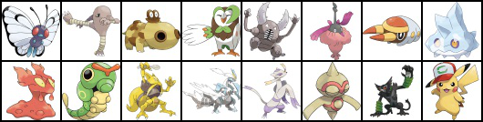
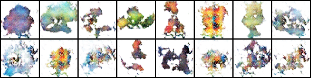

# Pokemon Generator

## In a Word
Generating new pokemon images with DCGAN.

## Source of Data
Pokemon Wikipedia(https://wiki.52poke.com).

## Model
DCGAN[[1]](#1) built in PyTorch(https://pytorch.org/).

## Illustration
Real images:
>

Generated images:
>

## References
<a id="1">[1]</a> 
Radford, Alec and Metz, Luke and Chintala, Soumith (2015). 
Unsupervised representation learning with deep convolutional generative adversarial networks.
(https://arxiv.org/abs/1511.06434).
